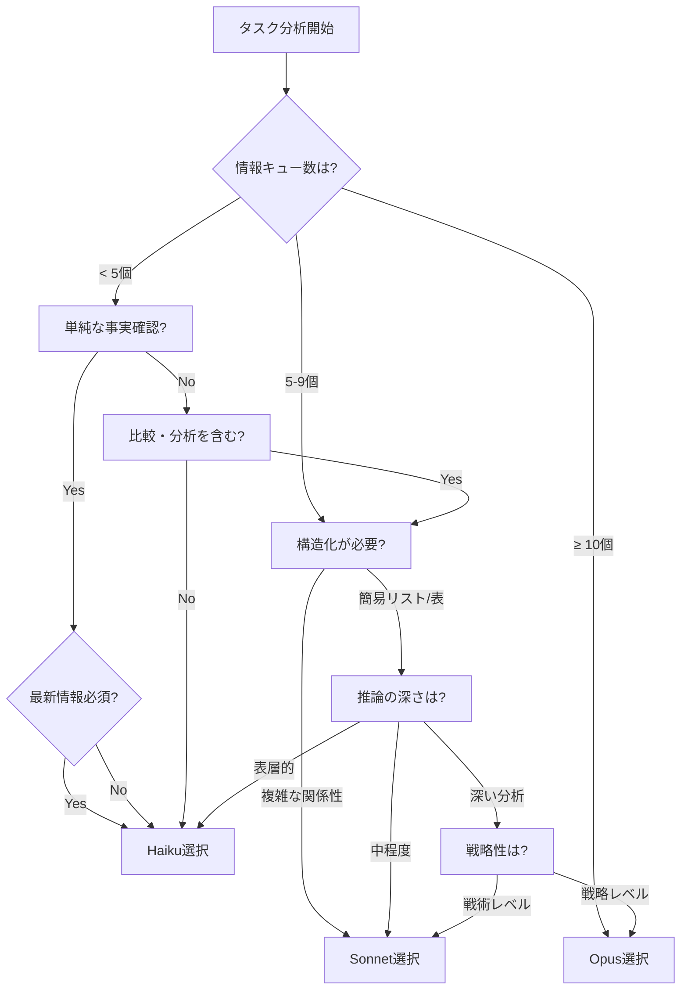

# CCM MCPネットリサーチエージェント モデル選択ガイドライン

## 概要
このガイドは、Opusエージェントがネットリサーチタスクを実行する際に、適切なモデル（Haiku/Sonnet/Opus）を自律的に選択するための判断基準を提供します。

## モデル能力マトリックス

| 能力 | Haiku | Sonnet | Opus |
|------|-------|--------|------|
| **単一情報の検索** | ✅ 完全対応 | ✅ 完全対応 | ✅ 完全対応 |
| **複数情報の統合** | ✅ 基本レベル | ✅ 高度対応 | ✅ 最高レベル |
| **構造化出力** | ✅ 簡易構造 | ✅ 複雑な構造 | ✅ 高度な構造 |
| **多段階推論** | ⚠️ 限定的 | ✅ 対応 | ✅ 完全対応 |
| **創造的分析** | ❌ 非対応 | ✅ 対応 | ✅ 高度対応 |
| **戦略的思考** | ❌ 非対応 | ⚠️ 基本レベル | ✅ 完全対応 |

## モデル選択フローチャート



## タスクタイプ別の判断基準

### Haikuで実行すべきタスク

**特徴: 単一焦点、明確な答え、構造化不要**

```yaml
適合タスク:
  - 製品/サービスの価格確認
  - リリース日や仕様の確認
  - 用語や概念の定義
  - 単一企業/製品の基本情報
  - Yes/No型の事実確認
  - 簡単なリスト作成（5項目以下）

判断基準:
  - 情報キュー数: < 5
  - 推論ステップ: 1-2段階
  - 構造化要求: 最小限
  - 創造性要求: なし
```

### Sonnetで実行すべきタスク

**特徴: 複数要素の統合、構造化出力、中程度の分析**

```yaml
適合タスク:
  - 3-5製品の詳細比較表作成
  - トレンド分析（3-5個の要因）
  - 技術仕様の体系的整理
  - 中規模データの分類・カテゴライズ
  - 実装可能性の評価
  - プロセスフローの文書化

判断基準:
  - 情報キュー数: 5-9
  - 推論ステップ: 3-5段階
  - 構造化要求: 表、階層、関係図
  - 分析深度: 中程度の因果関係把握
```

### Opusで実行すべきタスク

**特徴: 高度な統合、戦略的思考、創造的問題解決**

```yaml
適合タスク:
  - 包括的市場分析（10+要素）
  - 戦略立案と意思決定支援
  - 複雑なシステムアーキテクチャ評価
  - 多面的リスク分析
  - 長期的影響の予測
  - イノベーション機会の特定

判断基準:
  - 情報キュー数: ≥ 10
  - 推論ステップ: 6段階以上
  - 統合要求: 異種情報の高度な統合
  - 創造性要求: 新しい洞察の生成
```

## 実践的な判断アルゴリズム

```python
def select_model_for_research(task_description):
    """
    ネットリサーチタスクに最適なモデルを選択
    """
    
    # タスク特性の分析
    info_cues = count_information_cues(task_description)
    requires_structure = needs_structured_output(task_description)
    reasoning_depth = assess_reasoning_complexity(task_description)
    
    # 基本判定
    if info_cues < 5:
        if not requires_structure and reasoning_depth <= 2:
            return "haiku"
    
    elif info_cues <= 9:
        if requires_structure or reasoning_depth >= 3:
            return "sonnet"
        else:
            return "haiku"
    
    else:  # info_cues >= 10
        if requires_strategic_thinking(task_description):
            return "opus"
        else:
            return "sonnet"
    
    # デフォルト（安全側）
    return "sonnet"
```

## 特殊ケースの判断基準

### 時間制約がある場合
```
緊急度HIGH + 精度要求MEDIUM以下 → Haiku
緊急度HIGH + 精度要求HIGH → Sonnet
緊急度LOW + 最高品質要求 → Opus
```

### 反復タスクの場合
```
初回調査 → Sonnet/Opus（テンプレート作成）
2回目以降 → Haiku（テンプレート適用）
```

### 段階的調査の場合
```
Stage 1: 概要把握 → Haiku
Stage 2: 詳細調査 → Sonnet
Stage 3: 戦略分析 → Opus
```

## 判断の検証ポイント

### モデル選択後の確認事項

1. **Haikuを選択した場合**
   - タスクは本当に単純か？
   - 構造化は不要か？
   - 5個以上の要素を見落としていないか？

2. **Sonnetを選択した場合**
   - Haikuで十分ではないか？
   - Opusが必要なほど複雑ではないか？

3. **Opusを選択した場合**
   - 本当に戦略レベルの分析か？
   - Sonnetで段階的に実行できないか？

## エラー時のフォールバック戦略

```yaml
primary_attempt:
  model: [初期選択モデル]
  timeout: 180秒

fallback_1:
  condition: "タイムアウトまたは不完全な結果"
  action: "上位モデルへエスカレーション"
  
fallback_2:
  condition: "依然として不十分"
  action: "タスク分割して再実行"
```

## まとめ

### 基本原則
1. **情報キュー数を最初に評価**（< 5 → Haiku検討）
2. **構造化要求を確認**（必要 → Sonnet以上）
3. **戦略性を判定**（高い → Opus）

### 迷った場合の指針
- Haiku vs Sonnet で迷う → Sonnet
- Sonnet vs Opus で迷う → タスクを分割して判断

---

*このガイドラインはOpusエージェントの自律的判断を支援するために設計されています。*